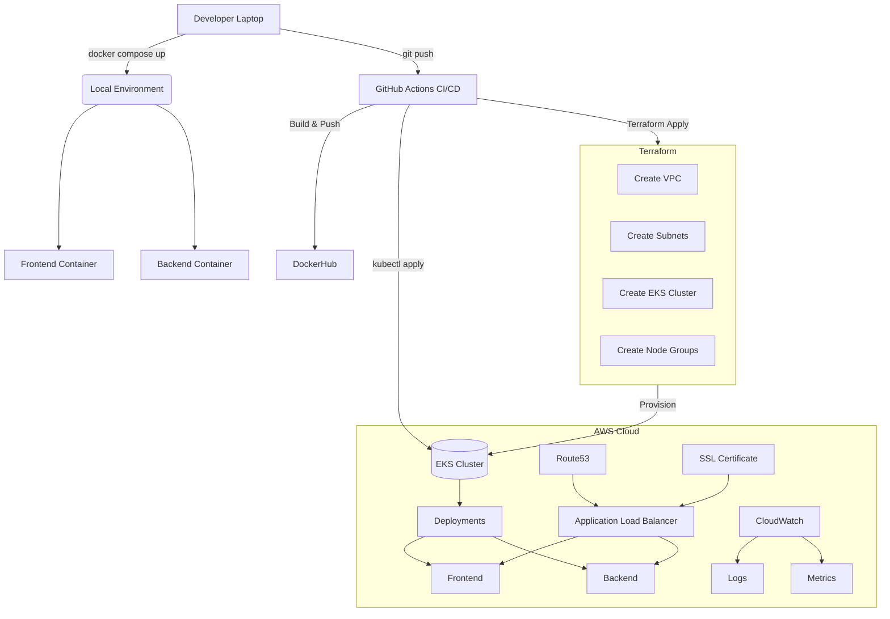

# Architecture Diagram (Mermaid)

```mermaid
graph TD;

A[Developer Laptop] -->|docker compose up| B(Local Environment);
B --> FE1[Frontend Container];
B --> BE1[Backend Container];

A -->|git push| CI[GitHub Actions CI/CD];

subgraph Terraform
TF1[Create VPC]
TF2[Create Subnets]
TF3[Create EKS Cluster]
TF4[Create Node Groups]
end

CI -->|Terraform Apply| Terraform;

Terraform -->|Provision| EKS[(EKS Cluster)];

subgraph AWS Cloud
EKS --> Deployments;
Deployments --> Frontend;
Deployments --> Backend;

ALB[Application Load Balancer] --> Frontend;
ALB --> Backend;

Route53 --> ALB;
ACM[SSL Certificate] --> ALB;

CloudWatch --> Logs;
CloudWatch --> Metrics;
end

CI -->|Build & Push| DockerHub;
CI -->|kubectl apply| EKS;
```
