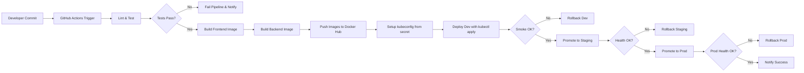

# CI/CD Pipeline (Mermaid)

```mermaid
flowchart LR
  A[Developer Commit] --> B[GitHub Actions Trigger]
  B --> C[Lint & Test]
  C --> D{Tests Pass?}
  D -- No --> X[Fail Pipeline & Notify]
  D -- Yes --> E[Build Frontend Image]
  E --> F[Build Backend Image]
  F --> G[Push Images to Docker Hub]
  G --> H[Setup kubeconfig from secret]
  H --> I[Deploy Dev with kubectl apply]
  I --> J{Smoke OK?}
  J -- No --> R[Rollback Dev]
  J -- Yes --> K[Promote to Staging]
  K --> L{Health OK?}
  L -- No --> S[Rollback Staging]
  L -- Yes --> M[Promote to Prod]
  M --> N{Prod Health OK?}
  N -- No --> T[Rollback Prod]
  N -- Yes --> O[Notify Success]
```
