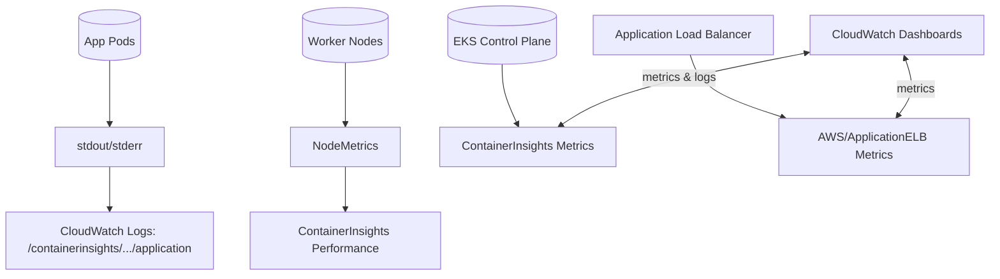

# Observability & Monitoring (Mermaid)

```mermaid
graph TD
  Pods[(App Pods)] --> Logs[stdout/stderr]
  Logs --> CWLogs[CloudWatch Logs: /containerinsights/.../application]
  Nodes[(Worker Nodes)] --> NodeMetrics
  NodeMetrics --> CWPerf[ContainerInsights Performance]
  Cluster[(EKS Control Plane)] --> CWMetrics[ContainerInsights Metrics]
  ALB[Application Load Balancer] --> ALBMet[AWS/ApplicationELB Metrics]
  CWDash[CloudWatch Dashboards] <-- metrics & logs --> CWMetrics
  CWDash <-- metrics --> ALBMet
```
