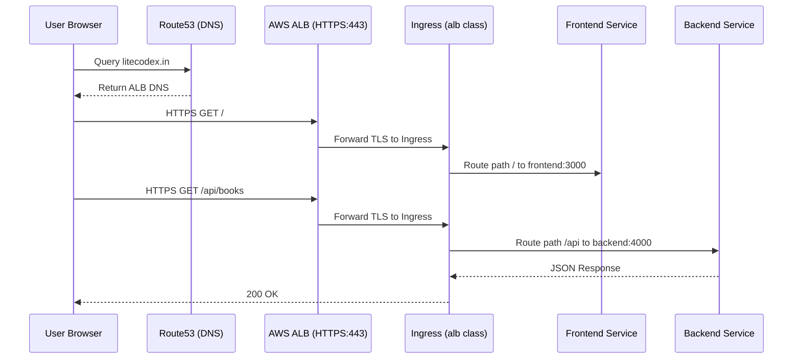

# Network & Ingress (Mermaid)

```mermaid
sequenceDiagram
  participant User as User Browser
  participant DNS as Route53 (DNS)
  participant ALB as AWS ALB (HTTPS:443)
  participant Ing as Ingress (alb class)
  participant FE as Frontend Service
  participant BE as Backend Service

  User->>DNS: Query litecodex.in
  DNS-->>User: Return ALB DNS
  User->>ALB: HTTPS GET /
  ALB->>Ing: Forward TLS to Ingress
  Ing->>FE: Route path / to frontend:3000
  User->>ALB: HTTPS GET /api/books
  ALB->>Ing: Forward TLS to Ingress
  Ing->>BE: Route path /api to backend:4000
  BE-->>Ing: JSON Response
  Ing-->>User: 200 OK
```
