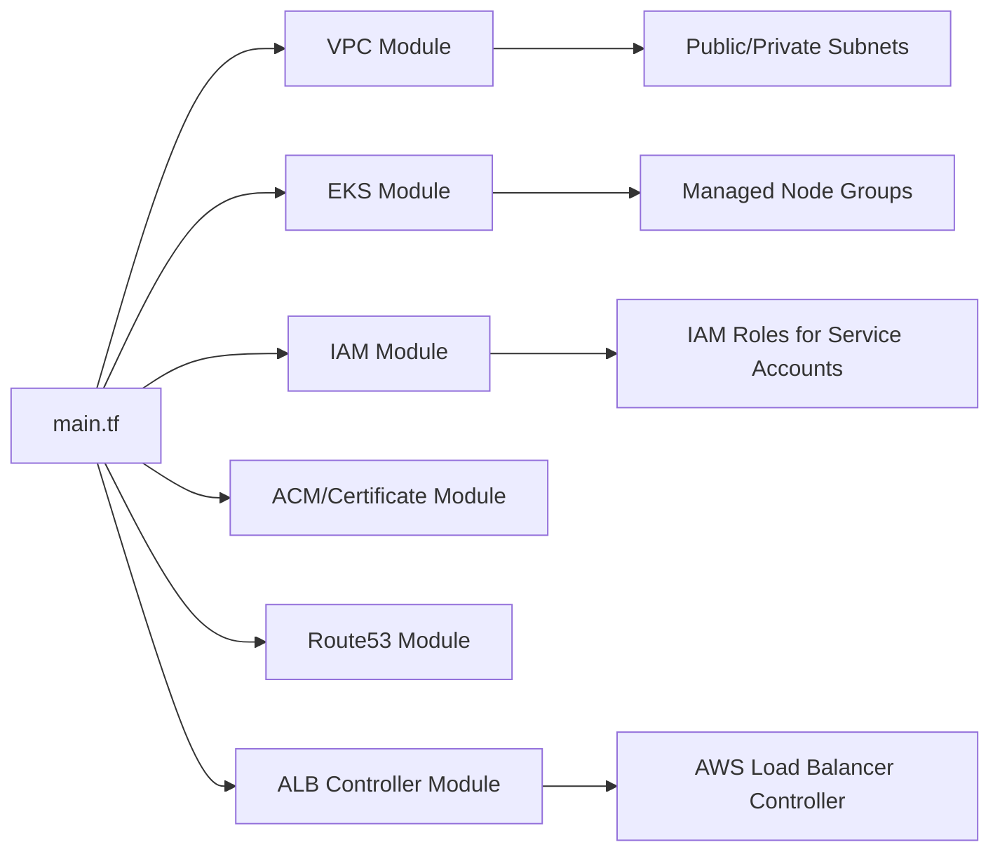

# Terraform Modules (Mermaid)

```mermaid
graph LR
  Root[main.tf] --> VPC[VPC Module]
  Root --> EKS[EKS Module]
  Root --> IAM[IAM Module]
  Root --> ACM[ACM/Certificate Module]
  Root --> R53[Route53 Module]
  Root --> ALB[ALB Controller Module]

  VPC --> Subnets[Public/Private Subnets]
  EKS --> NodeGroups[Managed Node Groups]
  IAM --> IRSA[IAM Roles for Service Accounts]
  ALB --> IngressCtrl[AWS Load Balancer Controller]
```
